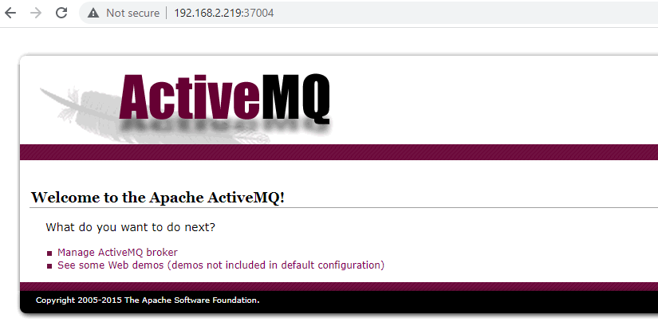
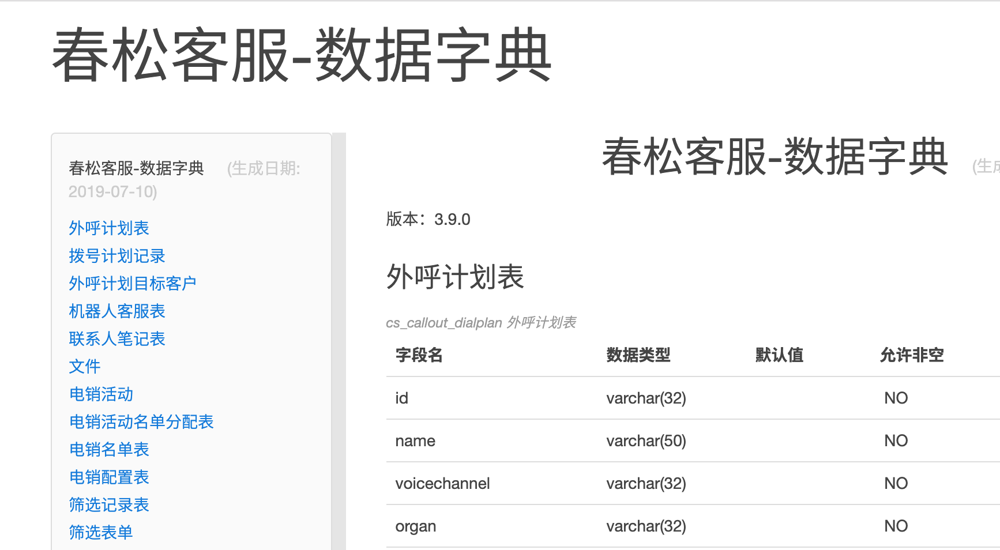
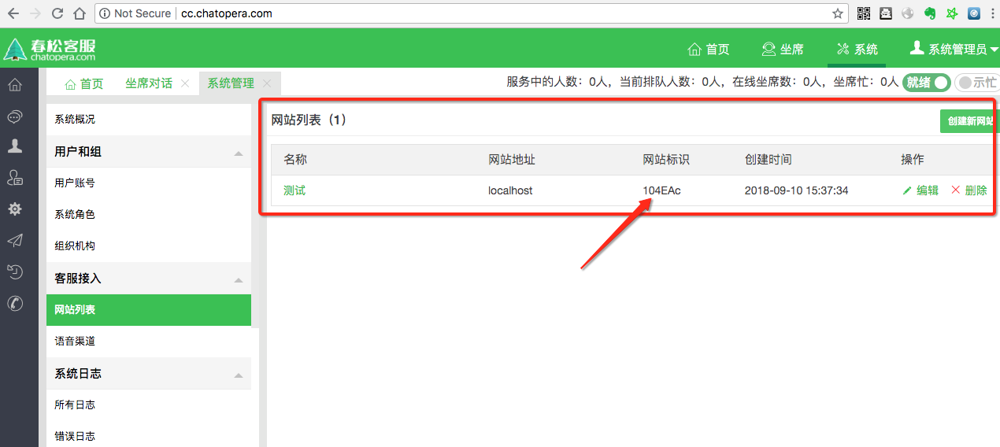
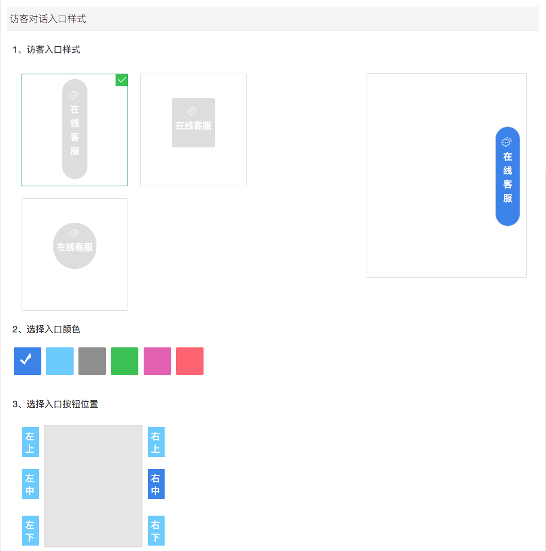
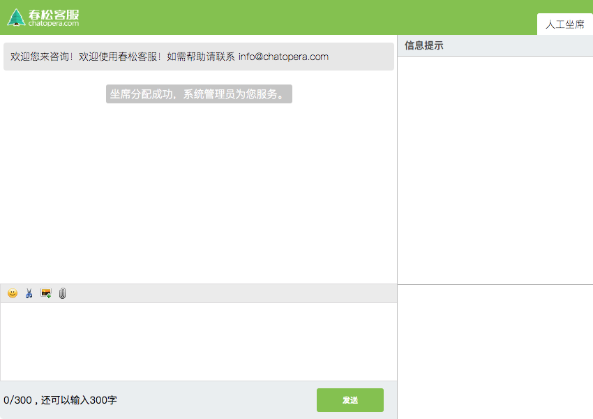

# 开发环境搭建

本文介绍如何完成春松客服开发环境的搭建，**面向企业/开发者提供关于春松客服二次开发的相关知识，从入门到掌握全部开发技能请学习[《春松客服大讲堂》](/docs/osc/training)**。

## 依赖

开发环境依赖，提前准备好：

- 操作系统 Windows 或 Mac OS
- [Git](https://git-scm.com/)
- [Java 11+](https://docs.aws.amazon.com/corretto/latest/corretto-11-ug/what-is-corretto-11.html)
- [Maven 3+](https://maven.apache.org/)
- [Docker 18+](https://www.docker.com/)
- [Docker compose 1.22+](https://docs.docker.com/compose/install/)

以上安装，也涉及环境变量 PATH 配置，比如 `java`, `mvn` 和 `git` 等在命令行终端中可以使用，在不同的依赖安装文档中也有。
在 Windows 上，命令行终端使用 Git Bash，安装 Git 时会默认包括。

提示：

1. Docker 或 Docker compose 可以安装到 Linux/Windows/Mac 上，Docker 在开发阶段用来启动数据库、中间件。

## 安装 Java SDK

春松客服使用[Amazon Corretto SDK 11](https://docs.aws.amazon.com/corretto/latest/corretto-11-ug/what-is-corretto-11.html)，原因：

- 兼容 OpenJDK 标准
- 良好的开源社区，可长期商业友好的使用，Amazon 发布，James Gosling 领导
- 适应不同操作系统

春松客服不使用其它版本的 JDK，如有其它 JDK 诉求自行测试：理论上，所有 OpenJDK 11 的 JVM 都是可以运行春松客服的。

## 配置 Maven

确保在 pom.xml 中存在如下的 maven 库，[Chatopera Nexus](https://nexus.chatopera.com/)是代理 Maven Central，Alibaba Maven Repo 等节点的混合 Maven Repository，使用 Chatopera Nexus 不会影响项目使用其它公共包（Artifacts）。

在`<repositories><repository>`内存在：

```XML
    <repositories>
        <repository>
            <id>chatopera</id>
            <name>Chatopera Inc.</name>
            <url>https://nexus.chatopera.com/repository/maven-public</url>
            <releases>
                <enabled>true</enabled>
            </releases>
            <snapshots>
                <enabled>true</enabled>
            </snapshots>
        </repository>
    </repositories>
```

配置文件的示例见 [pom.xml](https://github.com/cskefu/cskefu/blob/osc/contact-center/app/pom.xml)。

如配置后不能下载，请参考[配置文件](https://github.com/cskefu/cskefu/issues/137)。

## 克隆项目

### 准备 GitHub 账号

注册[地址](https://github.com/signup?user_email=&source=form-home-signup)，该注册依赖于邮箱。注册完成后，进行登录。

添加 SSH Key:

- 在 Terminal 命令行终端（Git Bash, Windows）执行命令 `ssh-keygen`，得到文件 `~/.ssh/id_rsa.pub` 并复制其文本内容到粘贴板。

- 打开 [SSH Keys 管理地址](https://github.com/settings/keys)，点击【New SSH Key】，使用粘贴板内容创建一个 SSH KEY。

### Fork 源码

在浏览器中，打开[春松客服项目地址](https://github.com/cskefu/cskefu)，在右上角，找到【Fork】按钮，点击【Fork】，根据提示选择空间，该项目源码将被复制到该空间。


克隆后，新的项目地址类似如下：

```Bash
https://github.com/${YOUR_SPACE}/cskefu  # ${YOUR_SPACE} 代表您的空间名称
```

### 下载源码

克隆项目，就是将上面新建的项目的源码，下载到计算机，使用命令行终端执行：

```Bash
git clone https://github.com/${YOUR_SPACE}/cskefu.git cskefu
# 默认为 osc 分支，OSC 代表 OpenSource Community
# 以下，使用 cskefu 代表源码所在路径
```

### 添加 Upstream

Upstream 指春松客服 OSC 分支，就是春松客服的项目库核心分支。添加 Upstream 的目的，是之后从春松客服项目拉取更新代码。

```Bash
cd cskefu
git remote add upstream git@github.com:cskefu/cskefu.git
```

完成以上步骤，克隆项目完毕。也请给春松客服点赞，使用【Fork】旁边的【Star】按钮。<!-- markup:skip-line -->

 开发，配置文件是

```路径
cskefu/contact-center/app/src/main/resources/application.properties
```

数据库（后文介绍搭建数据库）连接等其他信息，参考该文件。使用自定义值覆盖默认值，有以下两个方式：

1）使用 application-dev.properties；

2）使用环境变量。

### 使用 Profile 文件

使用 application-dev.properties 覆盖默认配置。

- 设置环境变量

```环境变量
SPRING_PROFILES_ACTIVE=dev
```

- 创建 application-dev.properties

```Bash
touch contact-center/app/src/main/resources/application-dev.properties
```

内容如下：

```文本
# MySQL
spring.datasource.url=jdbc:mysql://192.168.2.217:7111/cosinee?useUnicode=true&characterEncoding=UTF-8
spring.datasource.username=root
spring.datasource.password=123456

# Redis服务器连接端口
spring.redis.host=localhost
spring.redis.port=6379
# Redis服务器连接密码（默认为空）
spring.redis.password=

# ActiveMQ
spring.activemq.broker-url=tcp://192.168.2.217:9007
spring.activemq.user=admin
spring.activemq.password=123456

# Elasticsearch
spring.data.elasticsearch.cluster-nodes=192.168.2.217:7201
```

**此处可以覆盖 application.properties 中的任何值。**

### 环境变量

`application.properties` 中的每一项都可以用环境变量配置，通过环境变量方式映射配置信息，实现覆盖 `application.properties` 中等配置，其映射方式为 `propery` 的键转为大写同时`.`和`-`转为`_`。部分环境变量：

```环境变量
SPRING_DATASOURCE_URL=jdbc:mysql://mysql:3306/contactcenter?useUnicode=true&characterEncoding=UTF-8
SPRING_DATASOURCE_USERNAME=root
SPRING_DATASOURCE_PASSWORD=123456
```

比如，`SPRING_DATASOURCE_URL` 就是对应了 `properties` 文件中的 `spring.datasource.url`。同时，环境变量的值优先级高于 `properties` 文件。

> 提示：在生产环境部署，建议使用环境变量方式配置。

春松客服 Docker 容器的配置，使用了环境变量的方式，参考文件[docker-compose.yml](https://github.com/cskefu/cskefu/blob/osc/docker-compose.yml)。

## 数据库搭建

在源码中，默认使用 docker-compose 启动服务的描述文件 [docker-compose.yml](https://github.com/cskefu/cskefu/blob/osc/docker-compose.yml)，用于快速准备开发环境。

为了减少开发环境搭建可能遇到的问题，使用 [docker-compose.yml](https://github.com/cskefu/cskefu/blob/osc/docker-compose.yml) 中的 docker 镜像启动以下服务，尤其是春松客服对于一些软件的版本有要求，我们强烈建议开发者在入门春松客服开发的阶段，安装 docker 和 docker-compose，并按照下面的步骤配置开发环境。

这几个数据库，可以用一行命令启动：

```bash
cd cskefu
docker-compose up -d mysql elasticsearch activemq redis
```

另外，以下几个数据库服务可以运行在不同的计算机，以节省开发机器的资源；如果使用了不同的计算机运行。以下也给出如何逐个启动，如何修改配置文件。

### Elasticsearch

春松客服依赖 Elasticsearch 服务，用下面的方式创建。

```Bash
cd cskefu
docker-compose up -d elasticsearch
```

Elasticsearch 的配置项在 application.properties 是

```文本
spring.data.elasticsearch.cluster-name=elasticsearch
spring.data.elasticsearch.cluster-nodes=127.0.0.1:9300
```

将 cluster-nodes 配置为开发服务地址，默认为"YOUR_IP:9300"。

Elasticsearch 的数据浏览和管理，使用 [elasticsearch-head](https://github.com/mobz/elasticsearch-head)。

### ActiveMQ

春松客服依赖 ActiveMQ 服务，如果没有 ActiveMQ 服务，可以用下面的方式创建。

```Bash
cd cskefu
docker-compose up -d activemq
```

ActiveMQ 的配置项在 application.properties 是

```文本
spring.activemq.broker-url=tcp://localhost:61616
spring.activemq.user=admin
spring.activemq.password=admin
spring.activemq.pool.enabled=true
spring.activemq.pool.max-connections=50
```

将以上值修改为 ActiveMQ 的实际地址和密码。

ActiveMQ 管理工具，使用浏览器打开，<http://YOUR_ACTIVEMQ_IP:PORT。PORT> 默认是 `8051`，即[环境变量](https://github.com/cskefu/cskefu/blob/osc/docker-compose.yml) `ACTIVEMQ_PORT1`。



点击【Manage ActiveMQ broker】,用户名 admin, 密码 admin。

### MySQL

春松客服依赖 MySQL 服务，如果没有 MySQL 服务，可以用下面的方式创建。

```Bash
cd cskefu
docker-compose up -d mysql
```

MySQL 容器启动后，还需要创建春松客服数据库，该过程是在数据库上执行 SQL 文件([`contact-center/config/sql/cosinee-MySQL-slim.sql`](https://github.com/cskefu/cskefu/blob/osc/contact-center/config/sql/cosinee-MySQL-slim.sql))完成的。

#### 连接 MySQL 服务

安装 DBMS 管理工具 MySQL Workbench，下载地址：

<https://dev.mysql.com/downloads/workbench/>


在 Windows 上，MySQL Workbench 依赖 [Visual C++ Redistributable](https://docs.microsoft.com/en-US/cpp/windows/latest-supported-vc-redist?view=msvc-170)，需要提前安装。

使用`docker-compose`启动的 MySQL 服务，其连接认证信息如下：

| IP        | 用户名 | 密码   | 端口 |
| --------- | ------ | ------ | ---- |
| localhost | root   | 123456 | 8037 |
<!-- markup:table-caption MySQL Workbench 配置 -->


#### MySQL 数据字典

在线浏览[数据字典](https://chatopera.github.io/cskefu/)



#### SQL 快速入门

参考《春松客服大讲堂》之[春松客服开发基础知识 SQL 快速入门](https://www.bilibili.com/video/BV1ah411s7ak?p=1)。

### Redis

春松客服依赖 Redis 服务，如果没有 Redis 服务，可以用下面的方式创建。

```Bash
docker-compose up -d redis
```

Redis 启动后就可以，不需要其他操作。

Redis 管理工具，推荐 [AnotherRedisDesktopManager for Windows](https://github.com/qishibo/AnotherRedisDesktopManager/releases), [medis for macOS](https://github.com/luin/medis/releases)。

## 安装春松客服插件

春松客服的一些定制化需求是通过插件的形式发布的，插件让非通用需求和定制化开发的功能的源码与基础代码分离。一些插件是付费的，一些插件是免费的，比如**机器人客服插件**就是免费开源的。

插件的安装和源码参考：[https://github.com/cskefu/cskefu/tree/osc/public/plugins](https://github.com/cskefu/cskefu/tree/osc/public/plugins)

## 配置 IDE

春松客服开发支持的 IDE，包括所有的支持 Spring Boot 的 IDE，以下仅提供部分工具的文档。

- [Intelij IDEA](./ide_intelij_idea.md)
- [Eclipse IDE](./ide_eclipse.md)

配置完成后，需要继续完成以下内容。

## 初始化系统

启动调试服务，如果要定制化客服接待访客的代码，需要按照[系统初始化](/products/cskefu/initialization.html)文档做更多配置。

## 春松客服代码规范

为提升合作和可维护性，共同做好开源客服系统，修改春松客服代码，需要符合一定规范，这是对春松客服开源社区开发者的一致要求。

配置好开发环境后，阅读[《春松客服代码规范》](https://github.com/cskefu/cskefu/blob/osc/CODE_OF_CONDUCT.md)。

## 模拟访客端测试

介绍如何测试网页端访客程序，假设服务是自动在本地 `http://localhost:8035` 端口。

### 创建网站渠道

```文本
http://localhost:8035/
用户名：admin
密码：admin1234
```

保证有下面的一条网站渠道：



**注意**：网站地址为 _localhost_

### 设计网页端样式

在网站列表中，从右侧操作中点击“设计”。


按照需求配置各种属性。



### 访问测试程序

浏览器打开

```URL
http://localhost:8035/testclient.html
```



### 网站留言

如果当前系统中没有"在线"并且"就绪"的客服人员，则进入留言。

### 嵌入代码到网站中

在目标接入访客聊天控件的网站中，网页 HTML 的 header 中加入一行代码，就可以访问了，代码：

```HTML
<script defer="true" src="http://春松客服地址[:端口]/im/网站渠道标识.html"></script>
```

**注意**：如果使用 80 或 443 端口，可省略端口；请将网页放在 HTTP 服务器上，如果从浏览器中以本地文件打开因为安全限制会无法加载聊天控件。

HTML 示例：

```HTML
<!DOCTYPE html>
<html lang="zh">

<head>
    <!-- META -->
    <meta name="viewport" content="width=device-width; initial-scale=1.0; maximum-scale=1.0; user-scalable=0;">
    <meta http-equiv="Content-Type" content="text/html; charset=utf-8" />
    <script defer="true" src="http://cc.chatopera.com/im/104eac.html"></script>
</head>
<body>
春松客服演示客户端

</body>
</html>
```

<!-- markup:markdown-end -->

## 接下来

- [如何为开源客服系统春松客服贡献代码 | 春松客服](./contribution.md)

- [春松客服数据库表及管理 | 春松客服](https://blog.csdn.net/samurais/article/details/105807088)

- [春松客服的压力测试 | 春松客服](https://blog.csdn.net/samurais/article/details/105725876)
