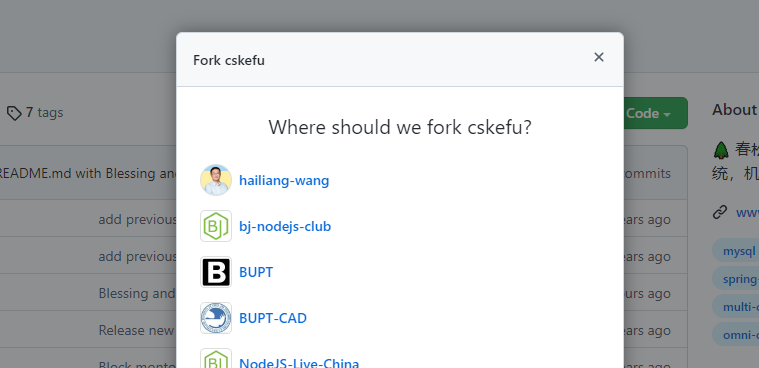

# 开发环境搭建

本文介绍如何完成春松客服开发环境的搭建，**面向企业/开发者提供关于春松客服二次开发的相关知识，从入门到掌握全部开发技能请学习[《春松客服大讲堂》](/docs/osc/training)**。

## 依赖

开发环境依赖，提前准备好：

- 操作系统 Windows 或 Mac OS
- [Git](https://git-scm.com/)
- [Java 11+](https://docs.aws.amazon.com/corretto/latest/corretto-11-ug/what-is-corretto-11.html)
- [Maven 3+](https://maven.apache.org/)
- [Docker 18+](https://www.docker.com/)
- [Docker compose 1.22+](https://docs.docker.com/compose/install/)

以上安装，也涉及环境变量 PATH 配置，比如 `java`, `mvn` 和 `git` 等在命令行终端中可以使用，在不同的依赖安装文档中也有。
在 Windows 上，命令行终端使用 Git Bash，安装 Git 时会默认包括。

提示：

1. Docker 或 Docker compose 可以安装到 Linux/Windows/Mac 上，Docker 在开发阶段用来启动数据库、中间件。

## 安装 Java SDK

春松客服使用[Amazon Corretto SDK 11](https://docs.aws.amazon.com/corretto/latest/corretto-11-ug/what-is-corretto-11.html)，原因：

- 兼容 OpenJDK 标准
- 良好的开源社区，可长期商业友好的使用，Amazon 发布，James Gosling 领导
- 适应不同操作系统

春松客服不使用其它版本的 JDK，如有其它 JDK 诉求自行测试：理论上，所有 OpenJDK 11 的 JVM 都是可以运行春松客服的。

## 配置 Maven

确保在 pom.xml 中存在如下的 maven 库，[Chatopera Nexus](https://nexus.chatopera.com/)是代理 Maven Central，Alibaba Maven Repo 等节点的混合 Maven Repository，使用 Chatopera Nexus 不会影响项目使用其它公共包（Artifacts）。

在`<repositories><repository>`内存在：

```XML
    <repositories>
        <repository>
            <id>chatopera</id>
            <name>Chatopera Inc.</name>
            <url>https://nexus.chatopera.com/repository/maven-public</url>
            <releases>
                <enabled>true</enabled>
            </releases>
            <snapshots>
                <enabled>true</enabled>
            </snapshots>
        </repository>
    </repositories>
```

配置文件的示例见 [pom.xml](https://github.com/cskefu/cskefu/blob/osc/contact-center/app/pom.xml)。

如配置后不能下载，请参考[配置文件](https://github.com/cskefu/cskefu/issues/137)。

## 克隆项目

### 准备 GitHub 账号

注册[地址](https://github.com/signup?user_email=&source=form-home-signup)，该注册依赖于邮箱。注册完成后，进行登录。

添加 SSH Key:

- 在 Terminal 命令行终端（Git Bash, Windows）执行命令 `ssh-keygen`，得到文件 `~/.ssh/id_rsa.pub` 并复制其文本内容到粘贴板。

- 打开 [SSH Keys 管理地址](https://github.com/settings/keys)，点击【New SSH Key】，使用粘贴板内容创建一个 SSH KEY。

### Fork 源码

在浏览器中，打开[春松客服项目地址](https://github.com/cskefu/cskefu)，在右上角，找到【Fork】按钮，点击【Fork】，根据提示选择空间，该项目源码将被复制到该空间。



克隆后，新的项目地址类似如下：

```Bash
https://github.com/${YOUR_SPACE}/cskefu  # ${YOUR_SPACE} 代表您的空间名称
```

### 下载源码

克隆项目，就是将上面新建的项目的源码，下载到计算机，使用命令行终端执行：

```Bash
git clone -b develop https://github.com/${YOUR_SPACE}/cskefu.git cskefu.develop
# 默认为 develop 分支, develop 分支为当前开发中的大版本；master 分支为发行版本的稳定分支
# 以下，使用 CSKEFU_ROOT 代表源码所在路径
```

### 添加 Upstream

Upstream 指春松客服 GitHub Repo（https://github.com/cskefu/cskefu），就是春松客服的项目库核心分支。添加 Upstream 的目的，是之后从春松客服项目拉取更新代码。

```Bash
cd $CSKEFU_ROOT
git remote add upstream git@github.com:cskefu/cskefu.git
```

完成以上步骤，克隆项目完毕。也请给春松客服点赞，使用【Fork】旁边的【Star】按钮。<!-- markup:skip-line -->

 <!-- markup:skip-line -->

## 目录结构说明

春松客服采用前后端分离架构，源码的目录结构说明如下：


```
.
├── compose                       # 使用 Docker Compose 启动目录
│   ├── databases
│   │   ├── mysql
│   │   └── redis
│   ├── docker-compose.yml
│   └── README.md
├── README.md
├── server                        # 服务器端 Server 程序
│   ├── serving-foo               # serving 前缀的是 Application
│   │   ├── src
│   │   ├── bin
│   │   ├── config
│   │   ├── data
│   │   ├── Dockerfile
│   │   ├── logs
│   │   ├── pom.xml
│   │   └── README.md
│   ├── mod-bar                   # mod 前缀的是模块、Lib
│   │   ├── src
│   │   ├── bin
│   │   ├── config
│   │   ├── data
│   │   ├── pom.xml
│   │   ├── logs
│   │   └── README.md
│   ├── mod-biz
│   └── 服务端项目根目录
└── web                           # 前端服务程序
    └── web前端项目根目录
```

### server
backend modules and apps.

* module - sub module as a maven project.
* serving - an application such as spring boot app.

For each module and app, following a folder structure -

```
pom.xml # for a maven project
src/ # source codes
config / # config file sample
data/ # data used by this app
logs/ # logs dir
bin/ # scripts or binary generated with this app
    start.sh # start this app 
    compile.sh # compile the source code to binary
    package.sh # package up the file
    dev.sh # start the app in development mode
    build.sh # build the app as a docker image
    run.sh # run the app with docker image
    push.sh # push the docker image into docker registry
  
Dockerfile # Docker file to build this app as a docker image
```

### web

frontend services for web clients. 

### compose

YML and data dirs to run with docker-compose.